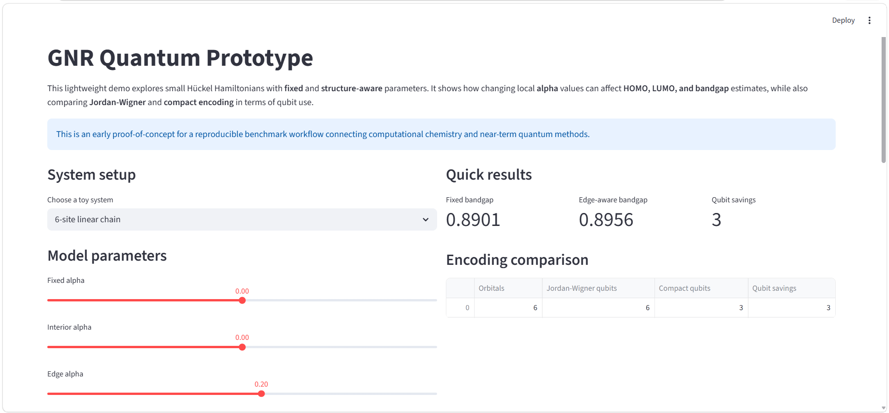
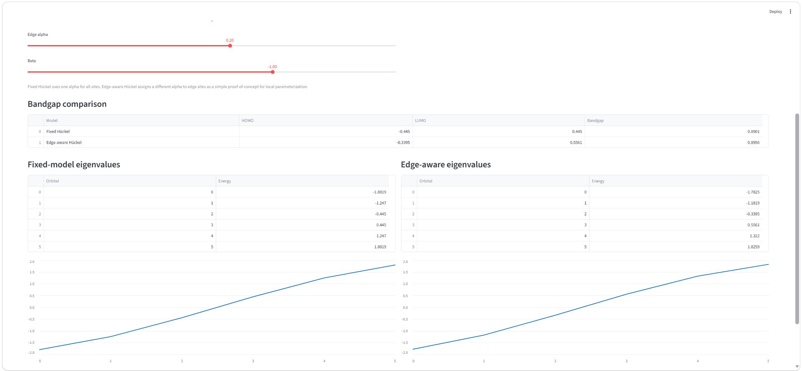

# GNR Quantum Prototype

GNR Quantum Prototype is an early open-source proof of concept for a reproducible benchmark workflow at the intersection of computational chemistry and near-term quantum methods. It explores small Hückel Hamiltonians with both fixed and structure-aware parameterization, estimates HOMO, LUMO, and bandgap values, and compares Jordan–Wigner and compact encoding in terms of qubit requirements.

## Overview

This project is designed as a lightweight educational and research demo for exploring how interpretable Hamiltonian models can connect to quantum-oriented workflows. Rather than treating bandgap prediction as a black-box problem, the prototype focuses on simple, physically meaningful parameterization and resource-aware comparison.

## Current Features

- Construction of toy Hückel Hamiltonians
- Classical solution of eigenvalues and frontier orbitals
- Estimation of HOMO, LUMO, and bandgap
- Simple structure-aware alpha parameterization
- Comparison of Jordan–Wigner and compact encoding
- Lightweight Streamlit demo for interactive exploration

## Why It Matters

This prototype provides a small but practical benchmark workflow for students and researchers interested in computational chemistry, Hamiltonian modeling, and near-term quantum computing. It is intended as an initial step toward a broader open-source toolkit for studying how compact quantum methods may connect to real chemistry and materials problems in a reproducible and interpretable way.

## Project Structure

- `app.py` – Streamlit demo interface
- `test_run.py` – simple test script for the prototype
- `src/huckel.py` – Hückel Hamiltonian construction and bandgap estimation
- `src/encoding.py` – encoding comparison utilities
- `requirements.txt` – project dependencies

## Running the Demo

Install the required packages:

```bash
pip install -r requirements.txt

## Demo Preview




